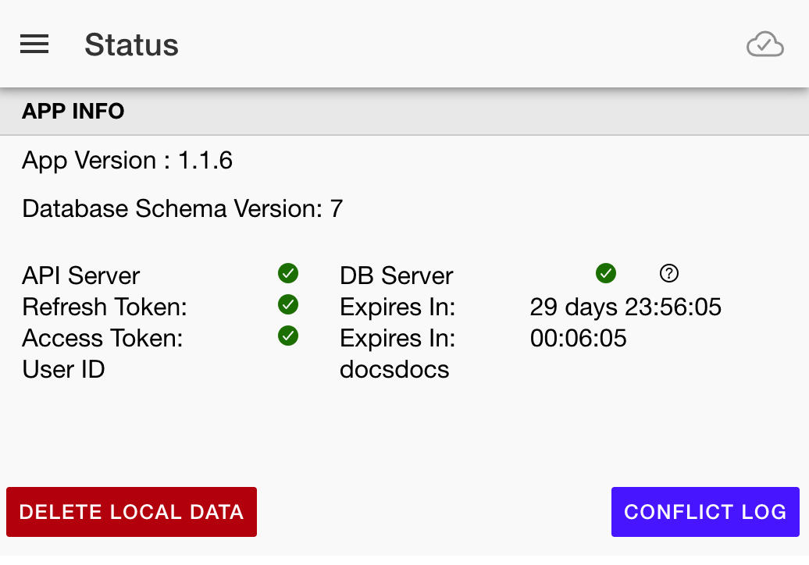

# Status

{align=right width=300}

The status page shows you detailed information about the current operating and connectivity status of the applicatio.

The application version is shown as well as the database "schema" version. This must match up with the schema version that the database server is running. 

Information is also provided on the status of the connection to the application (API) server as well as the database server. In addition, information is shown about the "refresh" token and the "access" token. Every time you login to the app with your user name and password you get a refresh token as well as an access token. The access token is used to get security access to the remote database and API server. This will typically expire in a "short" amount of time, which defaults to one day. As it gets close to the access token expiration time, the app will request a new access and refresh token as well. The refresh token expires in a longer time period, defaulting to 30 days. In normal usage, as long as you sign in once every 30 days, then, you will not need to re-provide the user name and password, but will login automatically using the tokens.  This portion of the setting screen shows when these tokens will be refreshed and their current status.

If things need to be "reset", you can click the "Delete Local Data" which will remove the locally synced database, and require you to sign in again to start. You will also very occasionally have to do this if a new application update changes the database schema. In this case, you will need to choose this option so your data can be resynchronized from the server, including the latest database updates associated with the new application version.

If your sync icon shows a conflict, you can also view the full conflict log from this page by clicking on the "Conflict Log" button.

